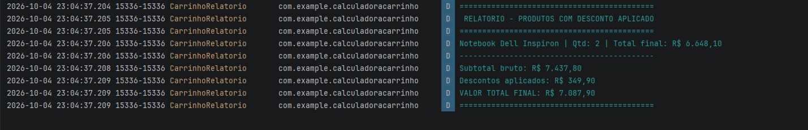

# Calculadora de Carrinho de Compras

**Aluno:** Leandro Sueoka
**Disciplina:** Programação para Dispositivos Móveis II
**Instituição:** Fatec Registro

## Descrição

Aplicativo Android desenvolvido em Kotlin com Jetpack Compose que simula um
carrinho de compras, aplica descontos e gera um relatório formatado no Logcat.

## Funcionalidades

- Catálogo fixo de 6 produtos com nome, preço, descrição e desconto
- Cálculo de subtotal bruto, descontos e total final
- Componente de UI reutilizável e parametrizado
- Relatório no Logcat com produtos que tiveram desconto aplicado

## Cenário de validação

| Item | Qtd | Total |
|---|---|---|
| Notebook Dell Inspiron | 2 | R$ 6.648,10 |
| Mouse sem fio | 1 | R$ 89,90 |
| Teclado mecânico RGB | 1 | R$ 349,90 |

- Subtotal bruto: **R$ 7.437,80**
- Descontos aplicados: **R$ 349,90**
- Valor total final: **R$ 7.087,90**

## Arquitetura

- `domain/` — modelagem, catálogo e funções puras de cálculo
- `ui/` — telas Compose e componentes reutilizáveis

## Capturas de tela

### Emulador

### Logcat

## Como executar

1. Clone o repositório
2. Abra no Android Studio
3. Execute em um emulador ou dispositivo físico
